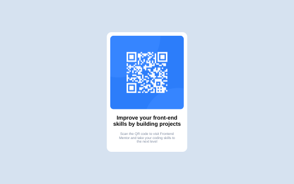

# Frontend Mentor - QR code component solution

This is a solution to the [QR code component challenge on Frontend Mentor](https://www.frontendmentor.io/challenges/qr-code-component-iux_sIO_H). Frontend Mentor challenges help you improve your coding skills by building realistic projects.

## Table of contents

-   [Overview](#overview)
    -   [Screenshot](#screenshot)
    -   [Links](#links)
-   [My process](#my-process)
    -   [Built with](#built-with)
    -   [What I learned](#what-i-learned)
    -   [Continued development](#continued-development)
    -   [Useful resources](#useful-resources)
-   [Author](#author)
-   [Acknowledgments](#acknowledgments)

**Note: Delete this note and update the table of contents based on what sections you keep.**

## Overview

The challenge is to build out this QR code component and get it looking as close to the design as possible.

### Screenshot

### Links

-   Solution URL: [Git Repository](https://github.com/murylearn/qr-code-component)
-   Live Site URL: [Live Preview](https://murytarlah.github.io/qr-code-component/)

## My process

I started out with the html and worked on the positioning and styling afterwards and lastly the animations

### Built with

-   Semantic HTML5 markup
-   CSS custom properties
-   Flexbox
-   CSS Animation

**Note: These are just examples. Delete this note and replace the list above with your own choices**

### What I learned

I got to learn about the SMACCS and BEM convention and tried implementing it in this project, although it's a relatively small project so might not be much, but looking forward to using more of BEM conventions on future projects

### Continued development

There won't be any aditional development on this project

### Useful resources

-   [`SMACCS`](http://smacss.com/) - This helped me understand how `CSS` can be broken down and modularised
-   [`BEM`](http://getbem.com/) - This is an amazing docs on `BEM` convention which helped me finally understand the naming convention in `BEM`. I'd recommend it to anyone still learning this concept.

## Author

-   Website - sadly no personal website yet, but you can check out my linked in profile [here](https://www.linkedin.com/in/murytarlah)
-   Frontend Mentor - [@murytarlah](https://www.frontendmentor.io/profile/murytarlah)
-   Twitter - [@murytarlah](https://www.twitter.com/murytarlah)
